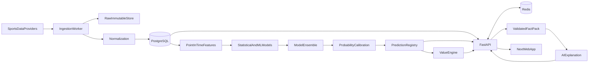
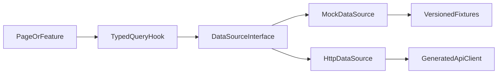

# Architecture technique

## 1. Décision structurante

PREDICTA AI adopte un **monorepo contract-first** avec :

- une application web Next.js;
- une API FastAPI en **monolithe modulaire**;
- des workers séparés pour l'ingestion et le ML;
- PostgreSQL comme source de vérité;
- Redis pour le cache et la coordination éphémère;
- des contrats OpenAPI versionnés comme frontière frontend/backend.

Cette architecture offre des frontières d'ownership claires aux agents sans introduire immédiatement la latence, l'observabilité distribuée et la gestion opérationnelle de microservices. Un module ou worker ne sera extrait en service autonome qu'après mesure d'un besoin de scalabilité, d'isolation ou de cycle de livraison.

## 2. Vue logique



Le chemin critique des probabilités s'arrête avant le LLM. L'explication ne peut pas réécrire les sorties du registre de prédictions.

## 3. Arborescence cible

Cette arborescence décrit la destination. Les dossiers ne sont créés qu'au démarrage de leur phase afin d'éviter des coquilles vides.

```text
predicta-ai/
├── AGENTS.md
├── README.md
├── docs/
│   ├── architecture.md
│   ├── product-spec.md
│   ├── api-contract.md
│   ├── data-model.md
│   ├── data-strategy.md
│   ├── data-providers.md
│   ├── data-pipeline.md
│   ├── data-quality.md
│   ├── development-conventions.md
│   ├── development-roadmap.md
│   └── adr/
├── contracts/
│   ├── openapi.yaml
│   └── events/                   # schémas d'événements lorsque nécessaires
├── apps/
│   ├── web/
│   │   ├── src/app/
│   │   ├── src/features/
│   │   ├── src/components/ui/
│   │   ├── src/components/domain/
│   │   ├── src/lib/api/
│   │   ├── src/lib/query/
│   │   ├── src/data/mock/
│   │   ├── src/data/http/
│   │   └── src/types/generated/
│   └── api/
│       ├── app/api/v1/
│       ├── app/core/
│       ├── app/modules/
│       ├── app/db/
│       ├── app/integrations/
│       ├── alembic/
│       └── tests/
├── workers/
│   ├── ingestion/                  # package predicta_ingestion (phase 3)
│   │   ├── src/predicta_ingestion/
│   │   ├── fixtures/mock/          # data_mode=mock uniquement
│   │   └── tests/
│   └── ml/
│       ├── src/features/
│       ├── src/models/
│       ├── src/ensemble/
│       ├── src/calibration/
│       ├── src/backtesting/
│       ├── src/registry/
│       └── tests/
├── packages/
│   ├── api-client/               # généré depuis OpenAPI
│   ├── ui/                       # primitives partagées si nécessaire
│   └── config/                   # configurations frontend communes
├── tests/
│   ├── contract/
│   ├── integration/
│   └── e2e/
├── infra/
│   ├── containers/
│   ├── migrations/
│   └── observability/
└── scripts/
```

## 4. Responsabilités des applications

### `apps/web`

- rendu, navigation, accessibilité et responsive;
- orchestration des requêtes avec TanStack Query;
- visualisation de données avec Recharts par défaut pour le prototype;
- consommation exclusive de la couche `DataSource`;
- formatage d'affichage, jamais calcul métier de référence;
- affichage de la provenance, fraîcheur et disponibilité.

### `apps/api`

- contrat HTTP, validation Pydantic et autorisation future;
- orchestration des cas d'usage;
- lecture/écriture via repositories;
- exposition des prédictions déjà calculées;
- calcul déterministe du Value Engine;
- construction du paquet de faits de l'AI Analyst;
- publication d'événements internes et invalidation du cache.

Modules métier initiaux :

- `catalog` : sports, compétitions, saisons, équipes et joueurs;
- `matches` : événements, calendrier et statut;
- `statistics` : statistiques normalisées par sport;
- `predictions` : probabilités, facteurs et versions;
- `odds` : snapshots, marchés et bookmakers;
- `value` : probabilité implicite, no-vig, edge et EV;
- `performance` : résultats, métriques et calibration;
- `ai` : fact packs, génération d'explications et audit.

Les modules communiquent par interfaces métier, pas par imports directs des tables d'un autre module.

### `workers/ingestion`

- intégrations provider isolées derrière des adaptateurs;
- conservation de payloads bruts immuables;
- déduplication et idempotence;
- mapping d'identités provider vers identités canoniques;
- normalisation, validation et contrôles de qualité;
- checkpoints, reprise et publication de données fraîches.

### `workers/ml`

- création de features point-in-time;
- entraînement et évaluation reproductibles;
- baselines statistiques puis modèles de boosting;
- ensemble, calibration et backtesting;
- enregistrement d'artefacts et de métadonnées;
- inférence batch initiale et publication atomique des prédictions.

### `packages/contracts`

Le contrat canonique réside dans `contracts/openapi.yaml`. Les types TypeScript sont générés et les schémas Pydantic doivent démontrer leur conformité. Aucun « type partagé » manuscrit ne doit diverger silencieusement du contrat.

## 5. Architecture frontend

### Organisation par feature

Chaque feature contient ses composants de composition, hooks de query et transformations de présentation. Les primitives visuelles restent dans `components/ui`; les composants sportifs réutilisables restent dans `components/domain`.

Les composants recommandés incluent `MatchCard`, `TeamLogo`, `ProbabilityBar`, `AIConfidence`, `ValueBadge`, `OddsDisplay`, `PerformanceChart`, `TeamComparison`, `MatchTimeline`, `Calendar`, `SportFilter`, `LeagueFilter`, `PredictionCard` et `InsightCard`.

### Couche d'accès aux données



Une factory choisit `mock`, `http` ou, temporairement, un mode hybride par configuration. Les composants ne testent jamais eux-mêmes l'environnement.

### État serveur

TanStack Query gère cache client, retries contrôlés, invalidation et état stale. Les clés sont centralisées et structurées par ressource et filtres. Les probabilités, cotes et fraîcheurs restent des données serveur; elles ne sont pas copiées dans un store global client.

### Rendu et graphiques

- Server Components pour le shell et les lectures stables lorsque cela est pertinent.
- Client Components seulement pour interactions, filtres et graphiques.
- Recharts comme choix initial pour accélérer le prototype; Visx n'est introduit que si une visualisation exige un contrôle bas niveau.
- Toute visualisation fournit un résumé textuel accessible.

## 6. Architecture backend

Le backend suit une séparation pragmatique :

```text
route Pydantic -> application service -> domain policy -> repository/integration
```

- Les routes ne contiennent pas de logique métier.
- Les services métier reçoivent des objets typés et sont testables sans HTTP.
- Les repositories cachent SQLAlchemy.
- Les intégrations externes sont protégées par timeout, retry borné et circuit breaker lorsque nécessaire.
- Les transactions sont définies au niveau du cas d'usage.
- Les tâches longues sont confiées aux workers; l'API ne lance pas d'entraînement.

L'API publique démarre sous `/api/v1`. Les breaking changes créent une nouvelle version majeure; les ajouts compatibles restent dans la version active.

## 7. Architecture data

### Couches

1. **Raw** : payload provider immuable, horodaté et associé à un checksum.
2. **Normalized** : entités canoniques et unités standardisées.
3. **Curated** : vues validées prêtes pour produit et features.
4. **Feature** : valeurs point-in-time avec définition et version.
5. **Prediction** : sorties immuables liées aux entrées et modèles.

### Garanties

- Temps d'événement distinct du temps d'ingestion.
- IDs provider conservés dans une table de mapping.
- Dates stockées en UTC; timezone d'origine conservée si utile.
- Unités et conventions de score explicites.
- Upserts idempotents sur clés naturelles documentées.
- Quarantaine des enregistrements invalides; aucune correction silencieuse.
- Métriques de complétude, fraîcheur, duplicats et anomalies.

Un stockage objet compatible S3 est recommandé à partir de l'intégration provider pour le raw et les artefacts ML. Il reste provider-neutral dans la fondation. La phase 3 utilise un filesystem immuable local derrière le même protocole `RawStore`.

Détail opérationnel : [data-strategy.md](data-strategy.md), [data-pipeline.md](data-pipeline.md), [data-quality.md](data-quality.md). Comparatif fournisseurs : [data-providers.md](data-providers.md). ADR : [0004](adr/0004-data-foundation.md).

## 8. Architecture ML

### Ordre d'introduction

- Football : Elo, Poisson, Dixon-Coles, puis XGBoost/LightGBM et ensemble.
- Basketball : Elo, ratings offensif/défensif, pace, home advantage, disponibilité, ensemble.
- Tennis : Elo joueur et surface, service/retour, forme, niveau de tournoi.

### Reproductibilité

Chaque exécution enregistre :

- sport, marché et horizon;
- version de code/commit;
- version des définitions de features;
- cutoff et hash du dataset;
- hyperparamètres et seed;
- métriques par split et segment;
- artefact de modèle, ensemble et calibrateur;
- environnement et versions de bibliothèques;
- statut `candidate`, `challenger`, `champion` ou `retired`.

Les artefacts binaires ne sont pas stockés dans Git. Le registre conserve leur URI et checksum.

### Backtesting

Le protocole est walk-forward :


- aucune random split pour les résultats temporels principaux;
- toutes les features respectent un cutoff antérieur au coup d'envoi;
- les cotes utilisées sont des snapshots réellement disponibles au cutoff;
- transformations et mappings sont ajustés sur train seulement;
- résultats rapportés globalement et par ligue, marché et horizon;
- comparaison systématique à une baseline;
- métriques : accuracy, log loss, Brier, courbes de calibration, ROI théorique, drawdown, couverture et nombre de prédictions.

### Calibration

La calibration utilise des sorties out-of-fold ou une validation temporelle dédiée. Platt/beta calibration convient aux petits volumes stables; isotonic n'est retenue qu'avec un volume suffisant. Pour le 1X2, la méthode doit préserver une distribution multiclasses cohérente.

Le calibrateur est versionné avec le modèle et l'horizon. Il n'est jamais ajusté sur le test final. Une dérive du Brier score ou de l'Expected Calibration Error déclenche une revue, pas une promotion automatique.

## 9. Cotes et Value Engine

Les cotes sont des snapshots append-only identifiés par provider, bookmaker, marché, sélection et `observed_at`.

Pour une cote décimale `o` et une probabilité calibrée `p` :

```text
implied_probability_raw = 1 / o
edge_raw = p - implied_probability_raw
expected_value = (p * o) - 1
```

Pour un marché exhaustif, le moteur peut calculer :

```text
overround = sum(1 / odds_i) - 1
no_vig_probability_i = (1 / odds_i) / sum(1 / odds_j)
edge_no_vig = p_i - no_vig_probability_i
```

Une évaluation de value conserve toutes ses entrées, la méthode de retrait de marge, la version de formule et le timestamp. Elle est refusée si la cote est invalide, périmée selon la politique du marché, ou si la probabilité n'est pas calibrée/compatible avec le marché.

## 10. AI Analyst

Le backend construit un `FactPack` en liste blanche. Chaque fait contient valeur, unité, source, date d'observation et statut de disponibilité. Le prompt interdit de compléter les lacunes.

La réponse conserve :

- l'identifiant du fact pack;
- les identifiants des faits cités;
- le modèle LLM et la version du prompt;
- les paramètres de génération;
- le timestamp et les contrôles de sécurité;
- un statut d'erreur clair si les données sont insuffisantes.

Le texte généré n'est jamais réinjecté comme feature ou probabilité sans pipeline de validation séparé.

## 11. PostgreSQL

PostgreSQL stocke les entités canoniques, observations, snapshots, prédictions, résultats et métadonnées. Les tables à fort volume sont conçues append-only et pourront être partitionnées temporellement après mesure.

Les migrations Alembic sont la seule voie de changement de schéma. Une migration ne doit pas dépendre d'un déploiement simultané non rétrocompatible : utiliser expand/migrate/contract.

Le modèle conceptuel détaillé se trouve dans [data-model.md](data-model.md).

## 12. Redis

Redis n'est jamais la source de vérité. Usages autorisés :

- cache-aside des lectures coûteuses;
- rate limiting futur;
- verrous distribués courts et tokens d'idempotence;
- coordination de jobs ou broker si la technologie de queue retenue le nécessite.

Convention de clé :

```text
predicta:{env}:{api_version}:{resource}:{identifier}:{variant}:{schema_version}
```

TTL indicatifs à confirmer par SLO :

- catalogue stable : 1 à 24 heures;
- matchs du jour : 30 à 120 secondes;
- statistiques live : 5 à 30 secondes;
- prédictions publiées : jusqu'à nouvelle version ou début du match;
- cotes : quelques secondes, selon limites provider;
- performance historique : 5 à 30 minutes.

L'écriture en base précède l'invalidation. Pour éviter le stampede, utiliser jitter, single-flight/verrou court et stale-while-revalidate sur les lectures admissibles.

## 13. Stratégie mock

### Fixtures

Les fixtures sont fictives, déterministes, versionnées et portent `data_mode: mock`. Elles couvrent :

- journée avec plusieurs ligues;
- détail complet;
- données partielles;
- aucun résultat;
- erreur provider simulée;
- données stale;
- prédiction sans cote;
- cote sans prédiction;
- états pre-match, live, terminé et reporté.

Les noms synthétiques ne doivent pas être présentés comme données actuelles réelles. Aucun mock n'est placé dans un composant.

### Remplacement progressif

1. Les mock handlers satisfont OpenAPI.
2. Le frontend utilise `DataSource`.
3. L'API implémente un endpoint.
4. Les contract tests comparent schémas et fixtures.
5. La configuration route cet endpoint vers HTTP.
6. Les métriques et états d'erreur sont vérifiés.
7. La fixture demeure disponible pour tests et Storybook, jamais pour production.

Un mode hybride est toléré pendant la migration, mais chaque réponse expose son `data_mode` pour empêcher un mélange invisible.

## 14. Observabilité et sécurité

- logs structurés avec correlation ID, sans secret ni payload LLM sensible;
- métriques de latence, erreurs, fraîcheur data, volume, qualité et cache hit rate;
- traces entre API et workers lorsque les flux existent;
- audit des publications de modèle, recalculs de value et analyses IA;
- secrets injectés par environnement, jamais dans Git;
- moindre privilège pour DB, Redis, stockage objet et providers;
- validation stricte des entrées et limites de taille;
- rétention et suppression des données utilisateur définies avant l'authentification.

## 15. Décisions différées

- fournisseur de données sportives V1 : tranché dans [ADR 0005](adr/0005-data-providers-v1.md), **non branché**;
- cloud et stockage objet (S3 prod ; filesystem en développement);
- queue/broker de jobs;
- fournisseur LLM;
- outil concret de model registry;
- authentification et billing;
- Visx à la place de Recharts pour des besoins avancés.

Ces choix exigent un ADR lorsqu'ils deviennent nécessaires. Ils ne changent pas les frontières définies ici.
